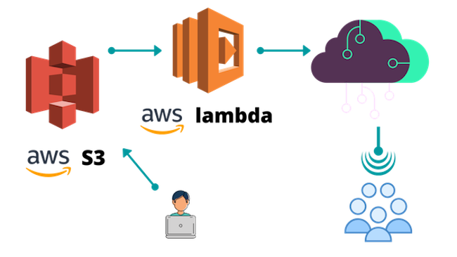
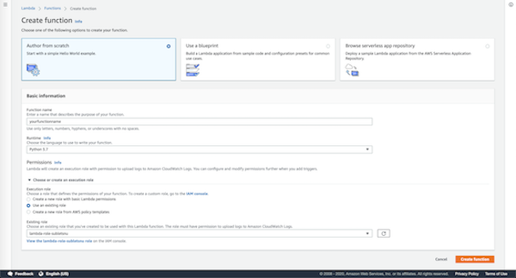
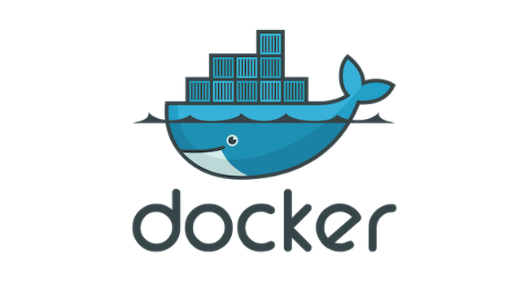

**Note: An AWS Account and a basic knowledge of their services are assumed throughout this blog post**

I have been working on a [team project](https://www.sublets.nu) for the past couple of months. The idea is to build a platform for off-campus room search, specifically geared towards students of Northwestern University. Django doing the heavy-lifting as the main engine to power the application, we were able to develop such a platform quite rapidly on our local development environment. We soon migrated our work to Heroku for production testing, and started serving media files from AWS S3 buckets. While user testing in preparation for a full launch of the application, a few non-trivial issues were found. As a room searching platform, our site needs to handle image requests adequately. However, our site suffered from a significant performance issue due to slow loading speed. Photos taken with the iPhones or the Samsung Galaxies these days typically are well over 2 MB in file size. Considering the fact that multiple photos are associated with a single room post and that multiple room posts need to be loaded on a single page, such an enormous file size quickly becomes prohibitive. We needed a solution to scale down large image files, without compromising image quality too much. Luckily, AWS already had advanced cloud computing services to help us achieve our goals: _AWS Lambda_.

## 1. What is AWS S3 & AWS Lambda?

The Amazon Simple Storage Service (Amazon S3) is a classic among a myriad of cloud services Amazon Web Services provide. S3 buckets simply provide space in remote Amazon servers for customers to store assets (or _objects_). It's an attractive service because customers don't have to worry about scalability, data availability, security, and performance themselves.

AWS Lambda is the other state-of-the-art technology we opted to use to solve our problem. Lambda lets you run code without provisioning or managing servers (hence, "serverless"), and you only need to pay for the total amount of compute time your application actually uses. All you need to do is upload your code and Lambda takes care of everything required to run and scale your code with high availability. Lambda is often configured to listen to certain event triggers (such as an object _put_ event to an S3 bucket), which is exactly what we want to do. We want to have our Lambda function resize an image file, and store it back into an S3 bucket of our choice. Our goal is to significantly reduce loading time, by scaling images down to a more sensible size.

## 2. Create an Execution Role

We are not going to go through creating the buckets themselves. Creating the buckets are a rather trivial task - consult the [documentation](https://docs.aws.amazon.com/AmazonS3/latest/user-guide/create-bucket.html) if necessary. Once the S3 buckets are set up, we will want to create a lambda function to attach to the buckets. Before we can create a lambda function, we need to create an execution role (AWSLambdaExecute) to grant explicit permission for our lambda function to manage objects in S3 buckets. Go ahead and create an execution role [here](https://console.aws.amazon.com/iam/home#/roles), with the following properties:

- Trusted entity – AWS Lambda
- Permissions – AWSLambdaExecute
- Role name - NameOfYourChoice

Once you have an execution role set up following the guidelines above, we can head over to the AWS Lambda management console to create the function.

## 3. Create the Lambda Function

## 3. Create the Lambda Function

Creating a lambda function is relatively straightforward. All we need to do is to navigate to the AWS Lambda management console, click "create function" and give it the execution role that we already created above.


Once the function is created, you will be able to see the control panel for the lambda function that you have just created. Your lambda function doesn't do anything yet, because we didn't write any code. There's an option to write code directly in the inline editor that AWS provides for us, but that's only possible if your lambda function does not have any external dependencies. Unfortunately, for image resizing, an external library must be installed for pretty much any language you might be working in (in Python, our code needs `Pillow` to work properly). This is where it gets tricky. The lambda function executes in an amazonlinux environment, which most likely is not identical to your local environment. AWS provides a [detailed guideline](https://docs.aws.amazon.com/lambda/latest/dg/python-package.html) on how to solve this problem - you have to upload your function as a deployment package. In other words, you need to package your function as a module (with all dependencies included) and ship it onto AWS Lambda so that it knows exactly what it's working with. The following is the lambda function that grabs an image from the source bucket, resizes it, then puts the resized image in the destination bucket.

#### lambda_function.py

```python
# lambda_function.py
import boto3
from io import BytesIO
from os import path
from PIL import Image

s3 = boto3.resource('s3')
INCOMING_BUCKET     = 'incoming-bucket-name'
DESTINATION_BUCKET  = 'destination-bucket-name'

def lambda_handler(event, context):
    for key in event.get('Records'):
        object_key = key['s3']['object']['key']
        extension = path.splitext(object_key)[1].lower()
        # Grabs the source file
        obj = s3.Object(
            bucket_name=INCOMING_BUCKET,
            key=object_key,
        )
        obj_body = obj.get()['Body'].read()

        # Checking the extension and
        # Defining the buffer format
        if extension in ['.jpeg', '.jpg', '.png']:
            format = 'JPEG'
        # Image resize
        image = Image.open(BytesIO(obj_body))
        output_size = (1000, 1000)
        image.thumbnail(output_size) # image.thumbnail preserves aspect ratio, does does not exceed specified size,
        buffer = BytesIO()
        image.save(buffer, format)
        buffer.seek(0)
        # Upload resized image to destination bucket
        obj = s3.Object(
            bucket_name=DESTINATION_BUCKET,
            key=f"{object_key}",
        )
        obj.put(Body=buffer)
        # Print to CloudWatch
        print('File saved at {}/{}'.format(
            DESTINATION_BUCKET,
            object_key,
        ))
        print("Image resize lambda handler completed.")
```

With the function written above, we can try to follow [guidelines](https://docs.aws.amazon.com/lambda/latest/dg/python-package.html) provided by Amazon to deploy our function as a package. Doing just that, I personally ran into issues with `Pillow`:

```console
ImportError: "Unable to import module 'lambda_function': cannot import name '_imaging' from 'PIL'
```

It is difficult to say whether or not you will run into the same issue. For me, it happened, and it didn't go away. After _lots_ of googling, I came to a logical conclusion that it has to do with the amazonlinux environment that my lambda function is running in. The reason why I say a _logical conclusion_ is because I did not get any errors when trying to reproduce the same error in the Python virtual environment that I packaged my function in:



After gaining confidence in where the general problem lies in, I narrowed down the issue: the problem seemed to be that the module `PIL` is already installed in the Python version that amazonlinux runs. `PIL` is shipped with Python by default, which is also the case in my local environment, except I can do:

```console
$ pip uninstall PIL
$ pip install Pillow
```

This is in fact the recommended installation procedure outlined in the [official documentation](https://pillow.readthedocs.io/en/latest/installation.html) of `Pillow`. However, this is not possible with AWS Lambda, because I have no direct ownership over the machine that the lambda function runs on. Of course, if you happen to be running the lambda function on an AWS EC2 instance that you have purchased, you are in luck. If not, don't worry. _Docker to the rescue_.

## 4. Docker to the Rescue



**Credits to [freecodecamp tutorial](https://www.freecodecamp.org/news/escaping-lambda-function-hell-using-docker-40b187ec1e48/)**

Docker technology is simply life-saving. I have no intensive background in working with Docker, but I was able to take a sneak peek at what Docker can offer to software developers. A simple introduction to Docker from their very own website: _"Containers are a standardized unit of software that allows developers to isolate their app from its environment, solving the “it works on my machine” headache. For millions of developers today, Docker is the de facto standard to build and share containerized apps - from desktop, to the cloud."_

Let's get started by spinning up a Docker container. This Docker container will be able to see the lambda function code that you have written.

```console
$ brew cask install docker
$ cd /your/path/to/aws_lambda_function
$ docker run -v <directory your code is in>:/aws_lambda -it --rm ubuntu
```

The docker command above does the following:

- The `-v flag` makes your code directory available inside the container in a directory called “aws_lambda”.
- The `-it flag` means you get to interact with this container.
- The `--rm flag` means Docker will remove the container when you’re finished.
- `ubuntu` is the name of an official container, Ubuntu. If this container image isn’t already on your machine, Docker will download it for you.

You should now see something like this:

# <<<<<<< HEAD

You should now see something like this:

> > > > > > > 64f6837c00efc42b048c360ebb5d55c44384b054

```console
root@c1996f32a397:/#
```

We now have to do a couple of "Ubuntu" things, before we can start baking the package to deploy on AWS Lambda.

```console
$ apt-get update
$ apt-get install python3-pip
$ apt-get install zip
```

That just got us everything we need to start installing our dependencies within the Docker container. What we are about to do is fairly simple, and is documented in the AWS [documentation](https://docs.aws.amazon.com/lambda/latest/dg/python-package.html). The only difference is that we are doing it within a Docker container instead of your local machine.

```console
$ cd aws_lambda
$ ls # you should be able to see your function source code here
lambda_function.py
$ pip3 install -t . Pillow # install package specifically into current directory
$ zip lambda_function.zip lambda_function.py # zip lambda_function.py
$ zip -r lambda_function.zip PIL # zip downloaded package PIL
$ zip -r lambda_function.zip Pillow* # zip downloaded packages Pillow-7.1.2.dist-info, Pillow.libs
$ exit
```

You should now see `lambda_function.zip` within your local directory that has your `lambda_function.py` file. The container is automagically removed, because we set an `--rm` flag when we ran the docker command. The `lambda_function.zip` archive is ready to be uploaded to AWS!

## 5. Deploy Your Package on AWS

The one final step remaining is to upload your zip file onto AWS. If your zip file is under 10 MB in size, you can upload it directly from the AWS Lambda console. If not, it is recommended that you upload it to an S3 bucket first, then pull in the S3 bucket URL from AWS Lambda console. Once your package is deployed, you should be able to see your lambda function at work whenever the event you set is triggered.

There's just one last thing that I want to point out. In this blog post, we have been working with two different S3 buckets: grab from the source and put in the destination. I want to note that it's possible to work with just one bucket. There's a _caveat_ there, however. Carefully think through what will happen if we configure our lambda function to trigger upon a _put_ event at the S3 bucket. Yes, an _infinte loop_. Why? The initial _put_ event will trigger the lambda function, which will resize the image, and put it back in the same bucket. Then, the lambda function will be triggered _again_. It will not stop. Amazon will happily serve your lambda function by scaling the resources needed for your lambda function to keep on running an infinite loop. But you certainly won't be happy with that, or at least your wallet won't be. To prevent such a disaster from happening, you must configure a _prefix_ for your lambda function trigger. Instead of listening to _all_ _put_ events, it will now only listen for a specific _put_ event that matches a certain prefix. Of course, you will also have to make sure that the lambda function uploads to a path that does not start with the prefix you have set.

_Phewww_. That was a lot! If you've followed along, you now should have a functional lambda function resizing images for you behind the scenes. To recap, here are the steps we took:

- Create S3 bucket(s)
- Create an execution role for AWS Lambda
- Create an AWS Lambda function
- Write code for your function
- Package your function using Docker
- Upload the packaged function on AWS
- Enjoy!

Again, Docker really saved my life.
