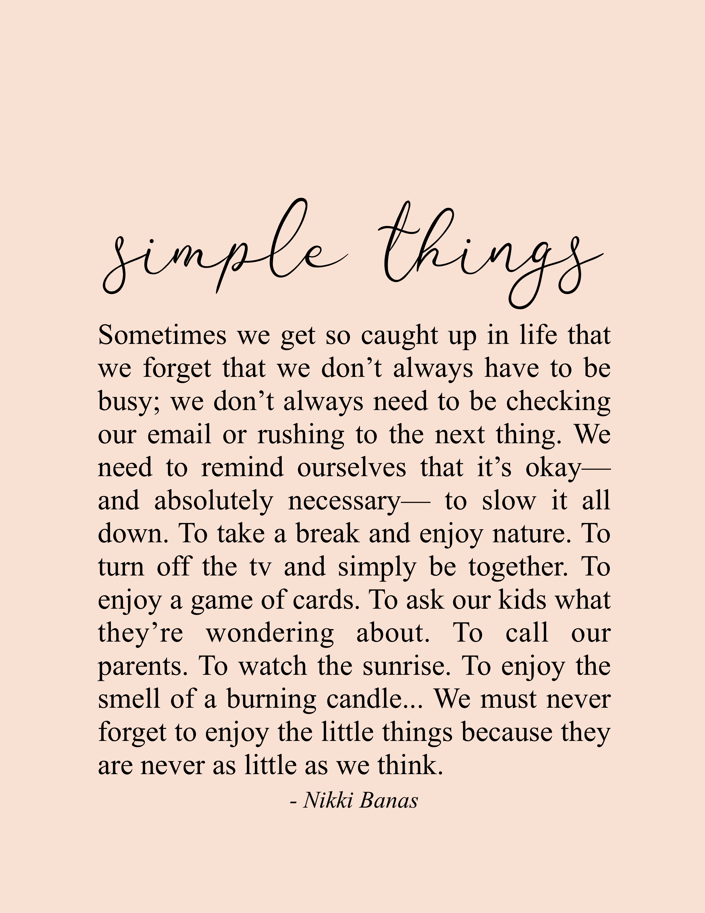

I never really followed up with my new year resolutions. To be honest, I usually on't really make one. But I will try this time, and I want to make it really simple, clear, and less than 5 things. Everyday, I will achieve one.

Five small promises.

1. Attend every classes synchronously unless I have an emergency.
2. Believe in myself. Whenever I have doubts or fears, just tell myself I can do it! Start my day with the mantra. Here are some of my favorite quotes that I can tell myself.

* You need to be content with small steps. That's all life is. Small steps that you take every day so when you look back down the road it all adds up and you know you covered some distance.
* Be not afraid of growing slowly, be afraid only of standing still.
* Don't judge each day by the harvest you reap, but by the seeds you plant.
* The key to realizing a dream is to focus not on success but on significance - and then even the small steps and little victories along your path will take on greater meaning.

3. Do 20 pushups everyday or alternatively, exercise
4. Commit to Github everyday. Plant greens!
5. Sleep early and eat healthy.
